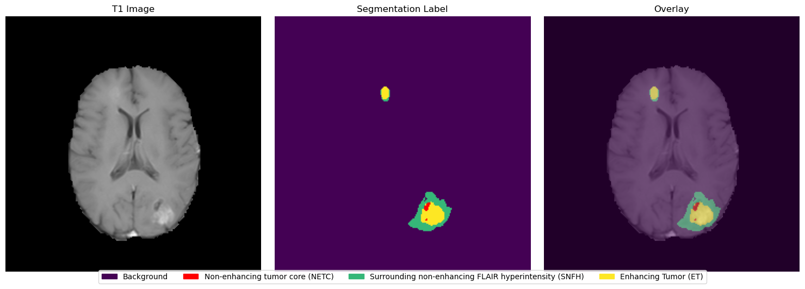

After completing the guidelines in the challenge, get your token and run `get_data_from_synapse.py`

This is how it will look after downloading. Note the path. Dont spiral if you cant find it.
```
Welcome, Bro!

 [####################]100.00%   1/1   Done...
    
Downloading  [####################]100.00%   407.0bytes/407.0bytes (2.8MB/s) manifest.csv Done...
    
[syn64919665]: Downloaded to /home/localssk23/.synapseCache/952/153049952/MICCAI-LH-BraTS2025-MET-Challenge-TrainingData.zip   
Downloading files: 100%|█████████████████████████████████████████████████████| 33.5G/33.5G [06:18<00:00, 88.5MB/s, syn64919665]
```


*Figure 1: Label Frequency across images disregarding UCSD data*


*Figure 2: Sample case 00002 with Labels on T1c*


*Figure 2: Sample labels (in 3d) 00002*